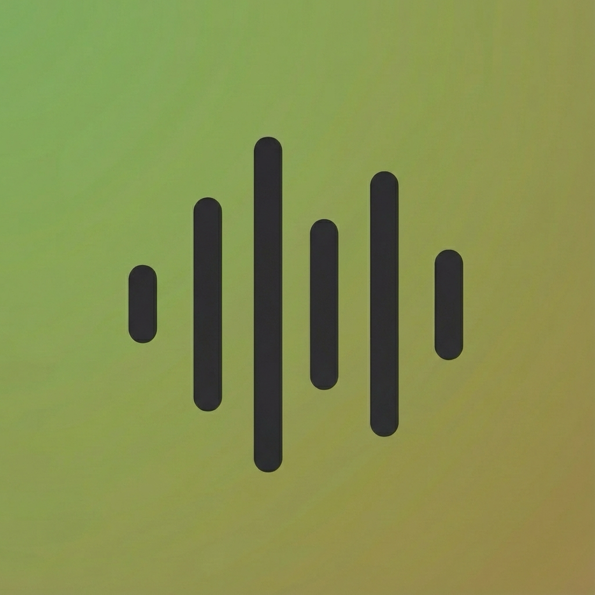

# 🎵 EzPlayer

<div align="center">

A lightweight, beautiful audio waveform player for macOS with A-B loop functionality.

**Built with SwiftUI • Monokai Pro Theme • Raycast Integration**



</div>

## ✨ Features

- **Waveform Visualization** - Real-time audio waveform display with playback progress
- **A-B Loop Playback** - Set start (S) and end (E) points for seamless loop practice
- **Variable Speed** - Playback speed control from 0.3x to 1.5x with preset buttons
- **Raycast Integration** - Quick launch from Finder via Raycast script
- **Video Support** - Auto-converts MP4/MOV/MKV to audio for playback
- **Monokai Pro Theme** - Beautiful dark interface with carefully chosen colors
- **Keyboard Shortcuts** - Full keyboard control for efficient workflow

## 📋 Requirements

- macOS 12.0 (Monterey) or later
- Xcode Command Line Tools (for building)
- [Raycast](https://www.raycast.com/) (optional, for Finder integration)
- [FFmpeg](https://ffmpeg.org/) (optional, for video-to-audio conversion)

## 🚀 Installation

### Option 1: Build from Source (Recommended)

1. **Clone the repository**

   ```bash
   git clone https://github.com/yourusername/EzPlayer.git
   cd EzPlayer
   ```
2. **Build the application**

   ```bash
   # Compile the Swift source
   swiftc -o EzPlayer Sources/main.swift \
     -framework Cocoa \
     -framework SwiftUI \
     -framework AVFoundation \
     -framework Accelerate

   # Create the app bundle
   mkdir -p EzPlayer.app/Contents/MacOS
   mv EzPlayer EzPlayer.app/Contents/MacOS/

   # Create Info.plist
   cat > EzPlayer.app/Contents/Info.plist << 'EOF'
   <?xml version="1.0" encoding="UTF-8"?>
   <!DOCTYPE plist PUBLIC "-//Apple//DTD PLIST 1.0//EN" "http://www.apple.com/DTDs/PropertyList-1.0.dtd">
   <plist version="1.0">
   <dict>
       <key>CFBundleExecutable</key>
       <string>EzPlayer</string>
       <key>CFBundleIdentifier</key>
       <string>com.ezplayer.app</string>
       <key>CFBundleName</key>
       <string>EzPlayer</string>
       <key>CFBundlePackageType</key>
       <string>APPL</string>
       <key>CFBundleShortVersionString</key>
       <string>1.0</string>
       <key>LSMinimumSystemVersion</key>
       <string>12.0</string>
       <key>CFBundleDocumentTypes</key>
       <array>
           <dict>
               <key>CFBundleTypeExtensions</key>
               <array>
                   <string>mp3</string>
                   <string>wav</string>
                   <string>m4a</string>
                   <string>aac</string>
                   <string>aiff</string>
                   <string>flac</string>
               </array>
               <key>CFBundleTypeName</key>
               <string>Audio File</string>
               <key>CFBundleTypeRole</key>
               <string>Viewer</string>
           </dict>
       </array>
   </dict>
   </plist>
   EOF
   ```
3. **Move to Applications (optional)**

   ```bash
   mv EzPlayer.app ~/Applications/
   ```

### Option 2: One-Line Build Script

```bash
# Run this in the EzPlayer directory
./build.sh
```

<details>
<summary>Create build.sh script</summary>

```bash
#!/bin/bash
set -e

echo "🔨 Building EzPlayer..."

# Compile
swiftc -o EzPlayer Sources/main.swift \
  -framework Cocoa \
  -framework SwiftUI \
  -framework AVFoundation \
  -framework Accelerate \
  -O

# Create app bundle
rm -rf EzPlayer.app
mkdir -p EzPlayer.app/Contents/MacOS
mv EzPlayer EzPlayer.app/Contents/MacOS/

# Info.plist
cat > EzPlayer.app/Contents/Info.plist << 'PLIST'
<?xml version="1.0" encoding="UTF-8"?>
<!DOCTYPE plist PUBLIC "-//Apple//DTD PLIST 1.0//EN" "http://www.apple.com/DTDs/PropertyList-1.0.dtd">
<plist version="1.0">
<dict>
    <key>CFBundleExecutable</key>
    <string>EzPlayer</string>
    <key>CFBundleIdentifier</key>
    <string>com.ezplayer.app</string>
    <key>CFBundleName</key>
    <string>EzPlayer</string>
    <key>CFBundlePackageType</key>
    <string>APPL</string>
    <key>CFBundleShortVersionString</key>
    <string>1.0</string>
    <key>LSMinimumSystemVersion</key>
    <string>12.0</string>
    <key>CFBundleDocumentTypes</key>
    <array>
        <dict>
            <key>CFBundleTypeExtensions</key>
            <array>
                <string>mp3</string>
                <string>wav</string>
                <string>m4a</string>
                <string>aac</string>
                <string>aiff</string>
                <string>flac</string>
            </array>
            <key>CFBundleTypeName</key>
            <string>Audio File</string>
            <key>CFBundleTypeRole</key>
            <string>Viewer</string>
        </dict>
    </array>
</dict>
</plist>
PLIST

echo "✅ Built successfully: EzPlayer.app"
```

</details>

## 🔗 Raycast Setup

EzPlayer includes a Raycast script for quick access. Select an audio/video file in Finder and trigger EzPlayer instantly!

### Setup Steps

1. **Open Raycast Preferences** → Extensions → Script Commands
2. **Add Script Directory**

   - Click "Add Directories"
   - Select `EzPlayer/Scripts/` folder
3. **Configure the script** (if needed)

   Edit `Scripts/ezplayer.sh` and update the `APP_PATH` variable:

   ```bash
   # Update to your EzPlayer.app location
   APP_PATH="$HOME/Applications/EzPlayer.app"
   ```
4. **Grant permissions**

   - On first run, grant Finder automation permission when prompted

### Usage

1. Select an audio or video file in Finder
2. Open Raycast (default: `⌘ + Space`)
3. Type "EzPlayer" and press Enter
4. The file opens in EzPlayer! 🎉

> **Tip**: For video files (MP4, MOV, MKV), the script will auto-convert to WAV using FFmpeg.

## ⌨️ Keyboard Shortcuts

| Shortcut       | Action                            |
| -------------- | --------------------------------- |
| `Space`      | Play / Pause                      |
| `Space × 2` | Jump to loop start (or beginning) |
| `← / →`    | Seek backward / forward 10s       |
| `⌘ ⇧ S`    | Set loop**S**tart point     |
| `⌘ ⇧ E`    | Set loop**E**nd point       |
| `⌘ ⇧ C`    | **C**lear all loop markers  |
| `⌘ /`       | Show keyboard shortcuts           |
| `⌘ ⇧ ?`    | Show documentation                |
| `⌘ W`       | Close window                      |
| `⌘ Q`       | Quit application                  |

## 🔁 Loop Playback Guide

EzPlayer's A-B loop feature is perfect for practicing music, transcribing audio, or studying specific sections:

1. **Click on the waveform** to select a position
2. Press **`⌘ ⇧ S`** to set the **Start** point (red "S" marker)
3. **Click another position** further ahead
4. Press **`⌘ ⇧ E`** to set the **End** point (blue "E" marker)
5. Playback will **automatically loop** between Start and End

The loop region is highlighted in yellow/orange on the waveform.

> **Note**: If you try to set End before Start, the markers will reset and your position becomes the new Start point.

## 🎵 Supported Formats

### Audio (Direct Playback)

- MP3, M4A, AAC
- WAV, AIFF
- FLAC (if system codec available)

### Video (Auto-converted to WAV)

- MP4, M4V, MOV
- MKV, WebM

> Video conversion requires [FFmpeg](https://ffmpeg.org/). Install with: `brew install ffmpeg`

## 🤝 Contributing

Contributions are welcome! Feel free to:

- Report bugs
- Suggest features
- Submit pull requests

## 📄 License

MIT License - feel free to use and modify as you wish.

---

<div align="center">

Made with ❤️ for audio lovers

</div>
